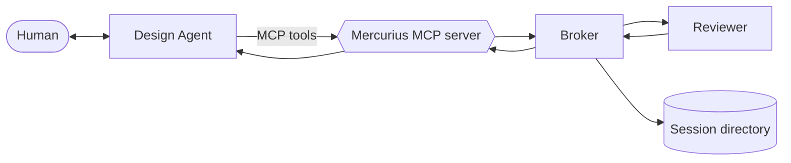

# Architecture and Storage

## Components



The broker owns session state, prompt assembly, artifact snapshots, reviewer dispatch, validation, and log writing. Reviewer implementations only run an underlying reviewer and return raw structured output. The reviewer is constructed once at broker startup and reused across all sessions.

## Session and Round Model

A **session** is a light grouping of related rounds. It owns an id, a folder, and an open/closed lifecycle. It does not own artifacts, decisions, or any state shared between rounds.

A **round** is the atomic review unit. It owns its artifacts, snapshot, prompt, reviewer output, and optional commentary/decisions (written to a sibling notes file). Rounds are single-shot: one round dispatches one review and accepts notes/decisions exactly once.

Nothing flows between rounds within a session: no decisions log carry-forward, no prior-decisions prompt block. To iterate, run another round in the same session with updated artifacts, or close the session and open a new one. Both are valid.

## Round Lifecycle

1. Validate session and artifacts.
2. Snapshot artifacts into `<session_dir>/round-NN/`.
3. Build the review prompt with review context, the settled-decisions guards (rendered as their own block when any are configured), what-to-flag criteria, fix sizing, project-specific focus, artifact contents, verdict/severity definitions, finding budget, and output schema. Calibration (`review_context`, `review_focus`, `settled_decisions`) is supplied per round by the MCP layer, which re-reads `mercurius.yaml` at the start of each round; the broker itself never reads the config.
4. Write the assembled prompt to `<session_dir>/round-NN/_prompt.md`, and the exact config bytes this round ran with to `<session_dir>/round-NN/_config.yaml`.
5. Dispatch to the configured reviewer.
6. Validate the raw reviewer output against the JSON schema, readiness consistency, and the finding limit.
7. Write `<session_dir>/round-NN/_round.md`.
8. Mark the round completed and make it collectible.

Failures after snapshotting are atomic: the partial round directory is removed; no round log is written; the round counter does not advance.

## Prompt Ownership

The broker is the only owner of the prompt. Reviewers receive an assembled `ReviewRequest` with:

- `Prompt`
- `Artifacts`
- `Schema`
- `SessionMeta` (session id + round number)

The current prompt always includes these sections in order:

- Role and readiness frame.
- Review context.
- Settled decisions (only when guards are configured).
- What to flag.
- Fix sizing.
- Project-specific focus.
- Artifacts under review.
- Verdict and severity definitions.
- Finding budget.
- Output instruction and JSON schema.

Artifact contents are inlined inside dynamic backtick fences so markdown artifacts containing code fences do not corrupt the prompt.

The assembled prompt is also written to `<session_dir>/round-NN/_prompt.md` during the snapshot step. The leading underscore reserves a namespace for broker-emitted meta files inside the round directory; artifact names cannot begin with `_`. The round log frontmatter includes a `prompt_path` field pointing at this file.

## Session Directory Layout

```text
<log_destination>/
  <session_id>/
    status.json
    _synopsis.md   (written by close_session)
    round-01/
      _round.md
      _prompt.md
      _config.yaml
      _notes.md     (only if record_round_notes was called)
      design
      work-order
    round-02/
      _round.md
      _prompt.md
      _config.yaml
      design
```

Each round gets its own self-contained folder. `_round.md` is the immutable log file. `_prompt.md` is the assembled prompt. `_config.yaml` is the exact `mercurius.yaml` bytes this round ran with, captured beside the rendered prompt so the round's input and output sit together: a guard present in `_config.yaml` but absent from `_prompt.md` (rendered empty) stays diagnosable after the fact. Because it is the raw config, `_config.yaml` can contain `reviewer.binary_path`, `model`, or `extra_args`; the `.mercurius/` tree is local and gitignored, so treat it accordingly. `_notes.md` is the (optional) sibling file holding commentary and decisions. Other files in the directory are the snapshotted artifacts under their declared names.

`status.json` is the latest durable monitor snapshot of session state. There is no `events.ndjson`: monitor `--wait` polls `status.json`. `_synopsis.md` is a session-level human-readable summary written by `close_session`; see Session Synopsis below.

## Round Logs

Each completed round writes a markdown log at `<session>/round-NN/_round.md`:

- YAML frontmatter with session id, round number, opened timestamp, verdict, prompt path, and reviewer names.
- Artifact manifest table.
- Reviewer output sections with usage notes and raw JSON.

The log is immutable after creation. Recording commentary and decisions through `record_round_notes` writes a sibling `_notes.md` file rather than mutating the log.

## Session Synopsis

`close_session` writes a session-level summary at `<session>/_synopsis.md`. The file opens with YAML frontmatter (session id, opened/closed timestamps, round count, reviewer, calibration-present flags, and last error if any), followed by a skimmable Summary section, a Round outcomes table with one row per round, and a per-round detail block that restates verdicts, findings, decisions, and commentary. The synopsis is rendered from in-memory session state at close time; if a round's reviewer output fails to parse, the synopsis emits a stable fallback pointing at that round's `_round.md` for the raw JSON. The per-round `_round.md` and `_notes.md` files remain the authoritative record.

## Reviewer Implementations

Current implementations:

- `codex`: runs the local `codex` CLI as a subprocess.
- `dummy`: returns a fixed valid response for tests and scaffolding.

The Codex reviewer runs `codex exec` with:

- ephemeral session
- read-only sandbox
- JSON schema file supplied through `--output-schema`
- final message captured through `--output-last-message`
- assembled prompt delivered on stdin

The reviewer performs output extraction only. Schema validation belongs to the broker.
