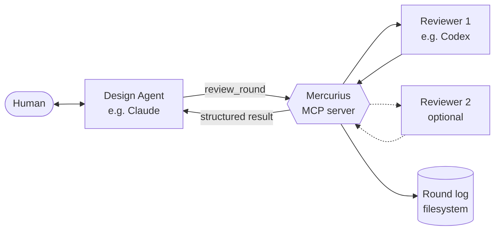

# Mercurius — Design

## 1. The problem in detail

When a human works with a design agent to elaborate a software concept, the work converges on two artifacts: a **design document** that captures intent and rationale, and a **work order** that translates intent into a concrete implementation plan. Before either artifact is durable enough to build from, an implementing agent should read both with a builder's eye and surface what's missing, ambiguous, or wrong.

In practice this surfaces several rounds of substantive feedback. Each round currently requires the human to:

- Copy the design doc and work order out of the design agent's context.
- Paste them into the implementing agent's session with a review prompt.
- Read the response.
- Reformulate the response back to the design agent.
- Watch the design agent integrate.
- Repeat.

The cost is twofold. The mechanical shoveling is dead time. More subtly, the human's attention is spent on transport instead of judgment — which is the only thing the human is uniquely positioned to provide.

Mercurius removes the transport cost while preserving — and structuring — the judgment surface.

## 2. Conceptual model

Five terms, used precisely throughout:

**Reviewer.** An agent that takes a set of artifacts and a review prompt and returns a structured assessment. Codex is the first reviewer implementation. The interface is small enough that other implementing agents — Claude in implementer mode, Gemini, a local model, anything — can satisfy it.

**Round.** A single pass: artifacts in, structured review out, log entry written. A round is atomic from Mercurius's perspective; it does not modify artifacts.

**Session.** A series of rounds against the same set of artifacts as they evolve. A session has a starting set of artifact versions, a budget, and a terminal verdict.

**Broker.** Mercurius itself. Orchestrates rounds, manages sessions, runs reviewers, writes logs, surfaces results.

**Round log.** A markdown record of one round, written to a configurable destination. Contains the input artifact references, the reviewer output, and slots for the design agent's commentary and the human's decisions. Logs accumulate as a project's review history.

The design agent is *not* a Mercurius concept. The design agent is whoever calls Mercurius via MCP — typically an LLM in a chat session with the human. Mercurius does not orchestrate the design agent's behavior; it provides a tool the design agent can use.

## 3. Architecture



The human stays in the design agent's chat. The design agent invokes Mercurius via MCP. Mercurius runs the configured reviewer(s), aggregates results, writes a log entry, and returns a structured payload to the design agent. The design agent is responsible for triage and surfacing.

## 4. The reviewer interface

The reviewer abstraction is intentionally small:

```go
type Reviewer interface {
    Review(ctx context.Context, req ReviewRequest) (ReviewResponse, error)
}

type ReviewRequest struct {
    Prompt      string            // the constrained review prompt
    Artifacts   []Artifact        // design doc, work order, optional context
    Schema      json.RawMessage   // expected response schema
    SessionMeta SessionMetadata   // session id, round number, prior decisions
}

type Artifact struct {
    Name    string  // logical name (e.g. "design", "work-order")
    Path    string  // absolute path; for the reviewer, points to the per-round snapshot
    Content []byte  // optional inline content at broker boundary; broker materializes it to a snapshot before dispatch
}

type ReviewResponse struct {
    Raw        json.RawMessage  // the reviewer's structured output
    UsageNotes string           // diagnostics, token counts, model id, etc.
}
```

The contract is: given a prompt, artifacts, and a target schema, produce structured output conforming to the schema. *How* a reviewer coerces structured output is the reviewer implementation's responsibility. Codex's reviewer impl handles codex's particular way of returning structured data; a future Claude impl handles Claude's way; and so on.

Mercurius owns the prompt template and the schema. Reviewers do not own the shape of the conversation — only the mechanism of running it.

## 5. Structured review output schema

This is the core data contract. The schema:

```json
{
  "verdict": "ready_to_build | needs_changes | needs_discussion",
  "summary": "one-paragraph high-level assessment",
  "concerns": [
    {
      "id": "stable identifier within the round",
      "severity": "blocker | major | minor",
      "location": "doc:section reference or N/A",
      "claim": "what the reviewer believes is wrong or missing",
      "rationale": "why it matters",
      "suggestion": "optional concrete fix"
    }
  ],
  "questions": [
    {
      "id": "stable identifier within the round",
      "topic": "what needs clarification",
      "why_it_blocks": "what the reviewer cannot decide without an answer"
    }
  ],
  "proposed_diffs": [
    {
      "id": "stable identifier within the round",
      "target": "artifact name and section",
      "patch": "concrete text or unified diff"
    }
  ]
}
```

Notes on the schema:

- **`verdict` is the headline.** A reviewer that returns `ready_to_build` with five blocker-severity concerns has produced a contradiction; the orchestrator surfaces this as a quality issue.
- **`severity` separates the no-brainers from the decisions.** Minor issues are presumptively integrable without human input. Blockers and majors need attention. The design agent uses severity as its first-pass triage signal.
- **`questions` are not concerns.** A question means the reviewer needs information before forming a position. The right response is usually an answer that gets folded into the next round's context, not a doc edit.
- **`proposed_diffs` are optional but valuable.** When the reviewer can articulate a concrete fix, the diff is more useful than a description of the fix. It also makes integration faster and reduces the chance of the design agent misinterpreting.

## 6. The round protocol

A round runs as follows:

1. **Snapshot artifacts.** Mercurius copies each artifact's current bytes (from source path, or from `Content` if supplied inline) into `<session_dir>/snapshots/round-NN/<artifact-name>`, computes a SHA-256 hash and byte size, and records a manifest entry per artifact. From this point on, the round operates exclusively against the snapshots — see §7 for the full snapshot model.
2. **Build the prompt.** Mercurius assembles the review prompt template with the schema, the artifacts (referenced via their snapshot paths), and session context (round number, prior decisions if available).
3. **Dispatch to reviewer(s).** One or more reviewers run in parallel. Each returns a `ReviewResponse` or an error.
4. **Validate output.** Each reviewer's `Raw` is validated against the schema. Validation failures surface as orchestrator errors, not silent passes.
5. **Write the log entry.** A round log file is written to the configured destination, containing the artifact manifest, all reviewer outputs, and an empty section for design-agent commentary and human decisions.
6. **Return to caller.** The MCP response includes the structured outputs and the path of the log entry.

A session is a wrapper around a series of rounds. Mercurius assigns session IDs and tracks rounds within them. Sessions terminate when the design agent calls `close_session` (typically because the verdict is `ready_to_build` or the human has stopped the loop).

Mercurius does not modify the design or work-order artifacts. The design agent and human do that, between rounds, in their own context. This boundary keeps Mercurius stateless with respect to the artifacts themselves.

## 7. Artifact snapshots and log layout

A round log that references artifacts only by their source path is not durable. Once the design or work-order file evolves, re-reading round 3's log shows you the current artifacts — not what the reviewer actually reviewed. The audit trail breaks the moment the artifacts change, which is in fact every round. The diff round described in §10 also requires durable round-0 artifacts to compare against.

Mercurius therefore takes per-round snapshots of every artifact under review and records each snapshot's metadata in the round log.

### On-disk layout

Each session writes to a directory under `log_destination`:

```
<log_destination>/
  <session_id>/
    round-01.md                    # round log entry
    round-02.md
    snapshots/
      round-01/
        design.md                  # snapshot of the artifact named "design"
        work-order.md              # snapshot of the artifact named "work-order"
      round-02/
        design.md
        work-order.md
```

Snapshot filenames mirror the artifact's logical name. If two artifacts in a session share a logical name, the broker errors at session-open time.

### Snapshot lifecycle

At the start of each round, before the reviewer runs:

1. Mercurius reads each artifact from its source path, or takes the bytes supplied inline via `Content`.
2. Mercurius writes the bytes to `snapshots/round-NN/<artifact-name>`, computes a SHA-256 hash and byte size.
3. The `Artifact.Path` handed to the reviewer points at the snapshot, not the source. The reviewer reads from the snapshot, ensuring the bytes it reviews are exactly the bytes the log records.
4. Mercurius records the artifact manifest in the round log entry.

Snapshots are written once and are immutable thereafter. They live for the lifetime of the session directory; cleanup is the user's responsibility (and is unlikely to be needed at typical scales).

### Round log artifact manifest

Each round log entry includes a structured manifest section recording, per artifact:

- **`name`** — the artifact's logical name, e.g. `design`, `work-order`.
- **`source_path`** — the absolute path the artifact was read from at round time, or `null` if supplied inline.
- **`snapshot_path`** — the absolute path of the per-round snapshot.
- **`size`** — byte size.
- **`hash`** — SHA-256 of the snapshot's contents.

The manifest is written when the round log is created and is immutable. Notes recorded against a round (commentary, decisions) extend other sections of the log file but never modify the manifest.

## 8. The MCP surface

Mercurius exposes a small MCP toolset:

- **`open_session(artifacts, reviewers?, budget?) → session_id`** — Start a new review session. `artifacts` names the files to be reviewed; `reviewers` optionally overrides the project-default reviewer config; `budget` sets a maximum round count.
- **`review_round(session_id, artifacts?) → round_result`** — Run a round. If `artifacts` is omitted, uses the session's most recent artifact set. The `round_result` contains the structured reviewer output(s) and the log entry path.
- **`record_round_notes(session_id, round_id, commentary?, decisions?)`** — Attach the design agent's commentary and the human's decisions to a completed round. Mercurius merges them into the round log file and into session state so they surface as prior decisions in subsequent rounds. Either field may be omitted; calling with both empty is an error. Subsequent calls for the same round replace prior notes.
- **`close_session(session_id, verdict)`** — Mark the session terminated. `verdict` is one of `built`, `abandoned`, or `paused`.
- **`session_status(session_id) → status`** — Read-only view of a session's history.
- **`list_sessions() → sessions`** — Enumerate sessions for observability.

A Mercurius server is bound to a single project at launch via its config file. The project's name and metadata are config-resident, not call-resident; tools do not take a `project` argument because there is only one project per running server.

`commentary` is a free-form markdown string written for human readers — typically the design agent's own framing of what happened in the round. `decisions` is a list of structured entries: `{ref, disposition, note}`, where `ref` is the concern or question `id` from the reviewer output, `disposition` is one of `accepted | rejected | deferred`, and `note` is a short rationale. Decisions accumulate across rounds in session state and feed the next round's `SessionMeta.PriorDecisions` as `{round, ref, disposition, note}` entries, so the reviewer can avoid re-raising adjudicated items.

The surface is deliberately narrow. Mercurius owns the round log structure end-to-end and exposes a single channel — `record_round_notes` — for the design agent to attach what was learned in the round. There is no separate "approve concern" or "dismiss question" tool; dispositions are recorded as decision entries on the round, not as state on individual concerns.

## 9. Panel mode

The single-reviewer case is the default. But sympathetic resonance applies to reviewers too: a single implementer-agent has a particular reading frame and may miss what a different prior would catch. Mercurius supports running N reviewers per round in parallel. Each produces an independent structured output.

Mercurius does **not** auto-merge panel results. Merging is a judgment task that belongs in the design agent's context, where the human is present. Mercurius returns all N results; the design agent presents them as a panel and lets the human navigate disagreement.

The case for panel mode is strongest when:

- The reviewers are from different model families (cross-prior).
- The work is high-stakes (architecture, security boundaries, data model).
- The design agent and one reviewer share a model family — running a second reviewer from a different family is the cleanest cross-check available.

The case against panel mode is cost and noise. Most rounds want one reviewer. Panel mode is configured per-session.

## 10. Drift detection

Tight review loops produce a particular failure mode: across many rounds, the design converges on a midpoint between the design agent's preferences and the reviewer's preferences, with no friction surfacing the drift. The doc at round 8 is internally consistent but no longer reflects what the human actually wanted at round 1.

Mercurius supports a **diff round**: a special round type that hands the reviewer the original artifacts (round 0) alongside the current artifacts and asks a single question — "what has been lost?" The reviewer's structured output for a diff round uses the same schema; concerns flagged are typically `major` and locate to "intent" rather than "implementation."

Diff rounds are triggered explicitly by the design agent (typically prompted by the human, or by a session budget threshold like "every 4th round"). Mercurius does not run diff rounds automatically, because automatic insertion would itself become invisible — the human should know when one is happening.

## 11. Configuration

A Mercurius server is launched against exactly one project, defined by a single config file passed on the command line (`mercurius.yaml` or `.json`). Per-project config:

- **`name`** — human-readable project name, used for log headers and surfaced in observability output. Metadata only; not used to route or filter.
- **`reviewers`** — list of reviewer configurations. Each has a name, an implementation type (e.g. `codex`), and impl-specific settings (binary path, model, additional flags).
- **`log_destination`** — absolute path of the directory where round logs are written. For Michael's setup this points into the grimoire's `software/<project>/reviews/` subtree; for other users it can point anywhere.
- **`prompt_overrides`** — optional project-specific additions appended to the standard review prompt template (e.g. "this project uses df/dl for logging; flag any ad-hoc logging").
- **`default_budget`** — default maximum rounds per session.

Reviewer implementations are registered in code, not config. Adding a new reviewer means writing a Go package that satisfies the `Reviewer` interface and registering it under a name. Configuration then references the name.

Running multiple projects means running multiple Mercurius servers, each against its own config file. There is no in-process multi-project mode in V1.

## 12. Out of scope

Stated explicitly to keep the boundary clean:

- **Mercurius does not edit artifacts.** Doc edits happen in the design agent's chat or by the human. Mercurius reads, never writes, the artifacts under review.
- **Mercurius does not orchestrate the design agent.** It provides a tool. The design agent's behavior — when to call, how to triage, how to surface — is outside Mercurius's scope.
- **Mercurius is not a CI system.** It is invoked from a chat session, not a pipeline. A future "headless" mode where Mercurius is run by a script is plausible but not in the initial scope.
- **Mercurius does not multiplex projects.** One server, one config, one project. Multi-project orchestration is deferred — running Mercurius against multiple projects means running multiple Mercurius servers.
- **Mercurius does not implement the implementing agent.** Codex remains the implementing agent; Mercurius is the broker that calls codex with a particular prompt and parses a particular response.

## 13. Codex reviewer invocation (V1)

The codex reviewer for V1 invokes the local `codex` CLI as a subprocess. Specifically:

- **Command:** `codex exec`. Not `codex review` — `codex review` is oriented around code diffs and would force the wrong frame onto a doc-review task.
- **Schema enforcement:** the JSON schema from §5 is written to a temporary file per round and passed via `--output-schema <path>`. This binds codex to the structured output contract at the model boundary, removing most of the output-coercion burden from the reviewer impl.
- **Output capture:** `--output-last-message <path>` writes codex's final structured response to a file Mercurius reads. Avoids parsing it out of stdout where it might mingle with progress output.
- **Prompt delivery:** the assembled review prompt — template plus session context — is fed to codex on stdin. The artifacts themselves are referenced by absolute path inside the prompt; codex reads them from the filesystem under its sandbox.
- **Sandboxing:** read-only sandbox. The reviewer must not modify artifacts or write outside its temp working directory. Mercurius does not expect codex to produce filesystem side effects.
- **Output coercion:** with `--output-schema` enforcing the contract upstream, the reviewer impl validates the captured output against the same schema and returns a structured error on mismatch. Strip a small set of conventional wrappers (markdown fences, stray prose) before validating; no auto-repair beyond that.

The codex MCP path — running codex behind its own MCP server and acting as an MCP client — is deliberately deferred. The subprocess shape is simpler, deterministic, and easy to reason about for V1. Revisit if and when V2 needs streaming, multi-turn within a round, or other affordances the subprocess can't cleanly provide.

## 14. Open questions

Items the design agent expects the implementing agent to push back on, agree with, or extend:

- **Session persistence.** Sessions live in process by default. Should they survive Mercurius restarts? For a chat-driven workflow, in-memory is probably enough. For multi-day reviews, on-disk session state under the log destination would help.
- **Concurrent reviewers and rate limits.** Panel mode may hit rate limits if reviewers share a backend. Mercurius should either parallelize naively and let the reviewer impls handle backoff, or provide a simple semaphore. Probably the former for V1.
- **Log format conventions.** Markdown is the format. The exact section structure deserves codex's review — what slots are useful, what is overkill.
