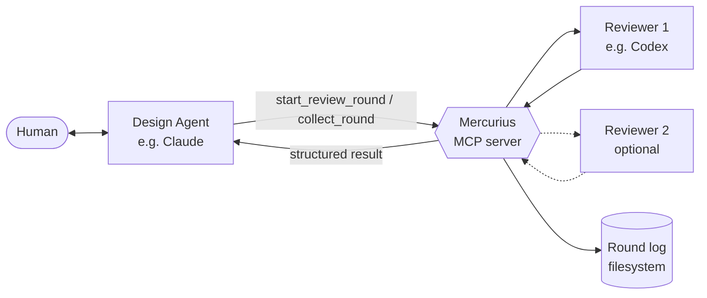

# Mercurius — Design

## 1. The problem in detail

When a human works with a design agent to elaborate a software concept, the work converges on two artifacts: a **design document** that captures intent and rationale, and a **work order** that translates intent into a concrete implementation plan. Before either artifact is durable enough to build from, an implementing agent should read both with a builder's eye and surface what's missing, ambiguous, or wrong.

In practice this surfaces several rounds of substantive feedback. Each round currently requires the human to:

- Copy the design doc and work order out of the design agent's context.
- Paste them into the implementing agent's session with a review prompt.
- Read the response.
- Reformulate the response back to the design agent.
- Watch the design agent integrate.
- Repeat.

The cost is twofold. The mechanical shoveling is dead time. More subtly, the human's attention is spent on transport instead of judgment — which is the only thing the human is uniquely positioned to provide.

Mercurius removes the transport cost while preserving — and structuring — the judgment surface.

## 2. Conceptual model

Five terms, used precisely throughout:

**Reviewer.** An agent that takes a set of artifacts and a review prompt and returns a structured assessment. Codex is the first reviewer implementation. The interface is small enough that other implementing agents — Claude in implementer mode, Gemini, a local model, anything — can satisfy it.

**Round.** A single pass: artifacts in, structured review out, log entry written. A round is atomic from Mercurius's perspective; it does not modify artifacts.

**Session.** A series of rounds against the same set of artifacts as they evolve. A session has a starting set of artifact versions, a budget, and a terminal verdict.

**Broker.** Mercurius itself. Orchestrates rounds, manages sessions, runs reviewers, writes logs, surfaces results.

**Round log.** A markdown record of one round, written to a configurable destination. Contains the input artifact references, the reviewer output, and slots for the design agent's commentary and the human's decisions. Logs accumulate as a project's review history.

The design agent is *not* a Mercurius concept. The design agent is whoever calls Mercurius via MCP — typically an LLM in a chat session with the human. Mercurius does not orchestrate the design agent's behavior; it provides a tool the design agent can use.

## 3. Architecture



The human stays in the design agent's chat. The design agent invokes Mercurius via MCP. Mercurius runs the configured reviewer(s), aggregates results, writes a log entry, and returns a structured payload to the design agent. The design agent is responsible for triage and surfacing.

## 4. The reviewer interface

The reviewer abstraction is intentionally small:

```go
type Reviewer interface {
    Review(ctx context.Context, req ReviewRequest) (ReviewResponse, error)
}

type ReviewRequest struct {
    Prompt      string            // the constrained review prompt
    Artifacts   []Artifact        // design doc, work order, optional context
    Schema      json.RawMessage   // expected response schema
    SessionMeta SessionMetadata   // session id, round number, prior decisions
}

type Artifact struct {
    Name    string  // logical name (e.g. "design", "work-order")
    Path    string  // absolute path; for the reviewer, points to the per-round snapshot
    Content []byte  // optional inline content at broker boundary; broker materializes it to a snapshot before dispatch
}

type SessionMetadata struct {
    SessionID      string           // opaque token identifying the session
    RoundNumber    int              // 1-indexed round currently being reviewed
    PriorDecisions []PriorDecision  // decisions accumulated from previous rounds in this session
}

type PriorDecision struct {
    RoundNumber int    // round in which this decision was recorded
    Ref         string // concern or question id from that round's reviewer output
    Disposition string // "accepted" | "rejected" | "deferred"
    Note        string // rationale recorded by the human
}

type ReviewResponse struct {
    Raw        json.RawMessage  // the reviewer's structured output
    UsageNotes string           // diagnostics, token counts, model id, etc.
}
```

The contract is: given a prompt, artifacts, and a target schema, produce structured output conforming to the schema. *How* a reviewer coerces structured output is the reviewer implementation's responsibility. Codex's reviewer impl handles codex's particular way of returning structured data; a future Claude impl handles Claude's way; and so on.

Mercurius owns the prompt template and the schema. Reviewers do not own the shape of the conversation — only the mechanism of running it.

## 5. Structured review output schema

This is the core data contract. The schema:

```json
{
  "verdict": "ready_to_build | needs_changes | needs_discussion",
  "summary": "one-paragraph high-level assessment",
  "concerns": [
    {
      "id": "stable identifier within the round",
      "severity": "blocker | major | minor",
      "location": "doc:section reference or N/A",
      "claim": "what the reviewer believes is wrong or missing",
      "rationale": "why it matters",
      "suggestion": "optional concrete fix"
    }
  ],
  "questions": [
    {
      "id": "stable identifier within the round",
      "topic": "what needs clarification",
      "why_it_blocks": "what the reviewer cannot decide without an answer"
    }
  ],
  "proposed_diffs": [
    {
      "id": "stable identifier within the round",
      "target": "artifact name and section",
      "patch": "concrete text or unified diff"
    }
  ]
}
```

Notes on the schema:

- **`verdict` is the headline.** A reviewer that returns `ready_to_build` with five blocker-severity concerns has produced a contradiction. The broker does not enforce this consistency rule — it returns the round normally, since the JSON is well-formed and schema-valid. The design agent is responsible for noticing the contradiction during triage and surfacing it to the human ("the reviewer said `ready_to_build` but flagged a blocker — what do you want to do?"). The prompt template instructs the reviewer not to produce contradictions in the first place; this triage path is the safety net for when it does anyway.
- **`severity` separates the no-brainers from the decisions.** Minor issues are presumptively integrable without human input. Blockers and majors need attention. The design agent uses severity as its first-pass triage signal.
- **`questions` are not concerns.** A question means the reviewer needs information before forming a position. The right response is usually an answer that gets folded into the next round's context, not a doc edit.
- **`proposed_diffs` are optional but valuable.** When the reviewer can articulate a concrete mechanical patch, the diff is more useful than a description of the fix. It also makes integration faster and reduces the chance of the design agent misinterpreting. A concern-level `suggestion` does not imply a corresponding `proposed_diffs` entry; `proposed_diffs: []` is normal when the reviewer has advice but no ready patch.
- **Findings are budgeted.** The project config's `max_findings` caps the total number of `concerns` plus `questions` in a single round. Reviewers should prioritize blockers and majors, then the highest-leverage minor flags or blocking questions. `proposed_diffs` are not counted as findings.

### Strictness

The schema is strict at the broker's validation gate:

- **Top-level fields required.** `verdict`, `summary`, `concerns`, `questions`, and `proposed_diffs` must all be present.
- **Arrays must be present, even when empty.** `concerns: []`, `questions: []`, and `proposed_diffs: []` are required forms when the reviewer has nothing to report. This eliminates ambiguity between "no concerns" and "the reviewer didn't think about concerns."
- **Per-entry fields required.** Within a `concerns` entry, `id`, `severity`, `location`, `claim`, `rationale`, and `suggestion` are required. `suggestion` is nullable; use `null` when there is no concrete suggestion. An empty string is not equivalent. Within `questions` and `proposed_diffs` entries, all documented fields are required.
- **Enums are closed.** `verdict` must be one of the three documented values. `severity` must be one of `blocker | major | minor`. Unknown values are rejected.
- **Unknown fields are rejected.** The schema sets `additionalProperties: false` at every object level, including the top level and within each array entry. This catches both reviewer drift (a model invents a new field) and version skew (the schema evolves but a reviewer hasn't been updated).

`--output-schema` enforces most of this upstream at the codex boundary, so the broker's validation step is typically a re-check rather than a primary line of defense. But the broker's check is the canonical gate (see §6 step 4), and the rules above are what it enforces.

## 6. The round protocol

A round runs as follows:

1. **Snapshot artifacts.** Mercurius copies each artifact's current bytes (from source path, or from `Content` if supplied inline) into `<session_dir>/snapshots/round-NN/<artifact-name>`, computes a SHA-256 hash and byte size, and records a manifest entry per artifact. From this point on, the round operates exclusively against the snapshots — see §7 for the full snapshot model.
2. **Build the prompt.** Mercurius assembles the review prompt template with the schema, the artifacts (referenced via their snapshot paths), and session context (round number, prior decisions if available).
3. **Dispatch to the reviewer.** The session's active reviewer runs and returns a `ReviewResponse` or an error. The interface and round log format are panel-shaped (array of reviewer outputs, per-reviewer H3 subsections), but V1 hard-limits each session to exactly one active reviewer; multi-reviewer panel mode is V2 — see §9.
4. **Validate output.** The broker validates each reviewer's `Raw` against the §5 schema. This is the canonical validation gate — reviewer implementations may perform local extraction or coercion (e.g., stripping markdown fences, unwrapping prose) before returning, but the broker is the only authority on whether the output is acceptable. A validation failure fails the round as a unit, surfaces as a `schema_violation` orchestrator error to the caller, and produces no log entry.
5. **Write the log entry.** A round log file is written to the configured destination, containing the artifact manifest, all reviewer outputs, and an empty section for design-agent commentary and human decisions.
6. **Return to caller.** The MCP response includes the structured outputs and the path of the log entry.

A session is a wrapper around a series of rounds. Mercurius assigns session IDs and tracks rounds within them. Sessions terminate when the design agent calls `close_session` (typically because the verdict is `ready_to_build` or the human has stopped the loop).

### Round failure is atomic

If any step after snapshotting fails — the reviewer errors, schema validation fails, or any other orchestrator-level fault occurs — the round fails as a unit. Mercurius:

- Deletes the snapshot directory it created in step 1.
- Does not advance the session's round counter.
- Does not consume budget.
- Does not write a log entry.

The error is returned as a tool-level MCP error result with full diagnostic content (reviewer name, error code, validation details, retry guidance, and next action). The caller can inspect or persist that response if needed. For an existing session, Mercurius also keeps the most recent broker error in `session_status.last_error` until a later successful session operation clears it. Mercurius does not preserve failure state on disk.

The semantics are: a failed round is as if it never happened. A subsequent `start_review_round` call will reuse the same round number, snapshot fresh bytes (which may have changed), and try again. This keeps `session_status.rounds` and `rounds_used` accurate to what actually completed, and keeps budget consumption visible to the user — runaway loops from a misconfigured reviewer surface as repeated failure responses, not as silently-burning budget.

Mercurius does not modify the design or work-order artifacts. The design agent and human do that, between rounds, in their own context. This boundary keeps Mercurius stateless with respect to the artifacts themselves.

### The standard review prompt

The broker assembles the review prompt by combining a fixed template with three runtime inputs — the artifacts under review (referenced by snapshot path with full content inlined), prior decisions accumulated from earlier rounds, and the §5 output schema — plus the project's `prompt_overrides` (see §11) inserted into a designated section.

The V1 template, with `{{double-brace}}` markers indicating substitution points the broker fills in:

````
You are reviewing project artifacts before implementation begins. Your job is to surface what is missing, ambiguous, contradictory, or wrong, before code gets written. You are not the implementer; you are the reviewer.

## Review criteria

For the design document, look for:
- Decisions that are described but not actually made (handwaves like "decided at scaffold time").
- Internal contradictions between sections.
- Affordances claimed but not specified (e.g., "the system supports X" without saying how).
- Architectural ambiguity that two implementers would resolve differently.

For the work order, look for:
- Scope items whose definition of done is not testable.
- Dependencies between milestones that are not stated.
- Concrete decisions deferred to implementation rather than settled.
- Test coverage gaps for the architectural commitments in the design.

For both, you may also surface points that are correct but worth flagging — small improvements, missed opportunities, or downstream considerations — at `minor` severity.

## Project-specific guidance

{{prompt_overrides_or_empty}}

## Artifacts under review

Read each artifact in full before forming a position.

{{for each artifact:}}
### {{name}}

Snapshot path: {{snapshot_path}}
Source path: {{source_path_or_inline}}
SHA-256: {{hash}}

{{open_fence}}
{{artifact_content}}
{{close_fence}}
{{end for}}

## Prior decisions

{{if prior_decisions is empty:}}
(No prior decisions; this is the first round of review for this session.)
{{else:}}
The following decisions have been adjudicated in earlier rounds. Do not re-raise them unless there is a substantive new reason — for example, the artifacts have changed materially since the decision was made. If you do re-raise a prior decision, your `rationale` must reference the prior decision and explain why it should be revisited.

{{for each prior decision:}}
- Round {{round_number}}, {{ref}} ({{disposition}}): {{note}}
{{end for}}
{{end if}}

## Verdict and severity

Apply these definitions precisely.

Verdict (the headline judgment for the whole review):
- `ready_to_build`: an implementer could pick up this work order and produce code that satisfies the design without further clarification. No `blocker` or `major` concerns are open.
- `needs_changes`: at least one `blocker` or `major` concern exists; the artifacts must be revised before implementation.
- `needs_discussion`: the artifacts are buildable, but at least one substantive question is open that the human and design agent should adjudicate before proceeding.

Severity (per concern):
- `blocker`: implementation cannot proceed without resolving this.
- `major`: implementation could proceed but would produce something materially different from intent.
- `minor`: small issues that can be fixed in passing without a round of revision.

A `verdict` of `ready_to_build` requires that all `concerns` are `minor` (or the `concerns` array is empty). Returning `ready_to_build` alongside any `blocker` or `major` concern is a contradiction; do not produce one.

## Finding budget

Return at most {{max_findings}} total findings across `concerns` and `questions` combined. Prioritize blockers and major concerns first, then the highest-leverage minor concerns or blocking questions. Do not pad the output to fill the budget.

## Output

Respond with a single JSON object only. No prose before or after, no markdown fence, no commentary outside the object. Your response must conform exactly to this schema:

```json
{{schema}}
```

Required fields must be present even when empty (e.g., `concerns: []`). Do not include fields not defined in the schema.
````

#### Required sections

Any future revision of the template must preserve the following sections, in order, even if the wording within them changes. The required-sections list is the structural commitment; the V1 template above is one realization of it.

- **Role and frame** — the opening "you are reviewing… not implementing" framing.
- **Review criteria** — what to look for in design docs and in work orders, including the rule that correct-but-worth-flagging points belong at `minor`.
- **Project-specific guidance** — the slot where `prompt_overrides` is substituted; rendered as the literal placeholder text "(no project-specific guidance)" when overrides are empty, so the section header always appears.
- **Artifacts under review** — each artifact's logical name, snapshot path, source path (or "inline" when supplied via `Content`), SHA-256 hash, and full content.
- **Prior decisions** — accumulated `SessionMeta.PriorDecisions` with the no-re-raise rule, or an explicit "no prior decisions" line when the list is empty.
- **Verdict and severity** — explicit definitions for both, including the `ready_to_build` ↔ severity consistency rule.
- **Finding budget** — the configured `max_findings` limit and prioritization instruction.
- **Output instruction** — JSON-only directive, schema inclusion in a fenced block, required-fields reminder.

Reviewer impls do not assemble or modify this prompt; the broker is the sole owner. Reviewers see the assembled string in `ReviewRequest.Prompt` and pass it to the underlying tool unchanged.

#### Wrapping rule for artifact content

Artifacts under review are typically markdown documents that contain their own triple-backtick fences. A naive wrapper fence would close on the first inner ``` and corrupt the prompt. The broker uses a **dynamic fence** for each artifact:

1. Scan the artifact's content for the longest run of consecutive backticks anywhere in the bytes.
2. Let `N` be the length of the longest run found, or `0` if the content has no backticks.
3. Use a fence of `max(3, N + 1)` backticks for both `{{open_fence}}` and `{{close_fence}}`. Open and close use the same fence length per artifact, but different artifacts within a single prompt may use different fence lengths.

Examples: an artifact with no backticks gets a 3-backtick fence (the markdown default). An artifact containing a single ```` ``` ```` (3-backtick) fence gets a 4-backtick fence. An artifact containing a 4-backtick fence gets a 5-backtick fence. The fence length is computed per-artifact at prompt-assembly time.

The same wrapping rule applies to any future template section that inlines content the broker did not author — for example, if a future revision renders `prompt_overrides` inside a fence, that fence must follow the dynamic-length rule against the overrides text. The V1 template renders `prompt_overrides` as inline markdown without a wrapping fence, so the rule does not currently apply to that slot.

## 7. Artifact snapshots and log layout

A round log that references artifacts only by their source path is not durable. Once the design or work-order file evolves, re-reading round 3's log shows you the current artifacts — not what the reviewer actually reviewed. The audit trail breaks the moment the artifacts change, which is in fact every round. The diff round described in §10 also requires durable round-0 artifacts to compare against.

Mercurius therefore takes per-round snapshots of every artifact under review and records each snapshot's metadata in the round log.

### On-disk layout

Each session writes to a directory under `log_destination`:

```
<log_destination>/
  <session_id>/
    round-01.md                    # round log entry
    round-02.md
    snapshots/
      round-01/
        design.md                  # snapshot of the artifact named "design"
        work-order.md              # snapshot of the artifact named "work-order"
      round-02/
        design.md
        work-order.md
```

Snapshot filenames mirror the artifact's logical name. If two artifacts in a session share a logical name, the broker errors at session-open time.

### Snapshot lifecycle

At the start of each round, before the reviewer runs:

1. Mercurius reads each artifact from its source path, or takes the bytes supplied inline via `Content`.
2. Mercurius writes the bytes to `snapshots/round-NN/<artifact-name>`, computes a SHA-256 hash and byte size.
3. The `Artifact.Path` handed to the reviewer points at the snapshot, not the source. The reviewer reads from the snapshot, ensuring the bytes it reviews are exactly the bytes the log records.
4. Mercurius records the artifact manifest in the round log entry.

Snapshots are written once and are immutable thereafter. They live for the lifetime of the session directory; cleanup is the user's responsibility (and is unlikely to be needed at typical scales).

### Round log file format

A round log is a single markdown file at `<session_dir>/round-NN.md`. The structure is fixed: every round log has the same sections in the same order, so the log writer produces consistent output and downstream tooling can parse it reliably.

````markdown
---
session_id: s_xK3p9q
round_number: 3
opened_at: 2026-05-04T18:32:14Z
verdict: needs_changes
reviewers:
  - codex
notes_recorded: false
---

# Round 03

## Artifact manifest

| name | source_path | snapshot_path | size | hash |
| --- | --- | --- | --- | --- |
| design | /abs/path/to/design.md | <session>/snapshots/round-03/design.md | 12453 | sha256:... |
| work-order | /abs/path/to/work-order.md | <session>/snapshots/round-03/work-order.md | 7641 | sha256:... |

## Reviewer outputs

### codex

**Usage notes:** `model=gpt-5-codex, tokens=4823`

```json
{
  "verdict": "needs_changes",
  "summary": "...",
  "concerns": [...],
  "questions": [...],
  "proposed_diffs": [...]
}
```

<!-- mercurius:notes-begin -->

## Commentary

_no commentary recorded yet_

## Decisions

_no decisions recorded yet_

<!-- mercurius:notes-end -->
````

#### Frontmatter

YAML frontmatter at the top, machine-readable. Fields:

- **`session_id`** — the session this round belongs to.
- **`round_number`** — 1-indexed integer.
- **`opened_at`** — RFC3339 timestamp, UTC.
- **`verdict`** — the headline verdict from the round's reviewer output. With a single reviewer, this is that reviewer's verdict. With multiple reviewers (panel mode), the most pessimistic wins: `needs_changes` > `needs_discussion` > `ready_to_build`.
- **`reviewers`** — list of reviewer names that participated in the round, in config order.
- **`notes_recorded`** — boolean. Flips to `true` after the first successful `record_round_notes` call for the round and stays `true` thereafter.

#### Artifact manifest

A markdown table with one row per artifact and one row per artifact only. Columns, in order: `name`, `source_path`, `snapshot_path`, `size`, `hash`. Written once on round creation; immutable thereafter.

Per-artifact field semantics:

- **`name`** — the artifact's logical name, e.g. `design`, `work-order`.
- **`source_path`** — the absolute path the artifact was read from at round time, or `null` if supplied inline via `Content`.
- **`snapshot_path`** — the absolute path of the per-round snapshot.
- **`size`** — byte size.
- **`hash`** — SHA-256 of the snapshot's contents, prefixed `sha256:`.

#### Reviewer outputs

An H2 section containing one H3 subsection per reviewer. The H3 heading is the reviewer's configured `name`. Each reviewer subsection contains, in order:

- A `**Usage notes:**` line with the reviewer's diagnostic string (model, token counts, anything the reviewer impl wants to record).
- A fenced JSON block containing the reviewer's `Raw` output, which conforms to the §5 schema.

Single-reviewer rounds have one H3 block. Panel-mode rounds have N H3 blocks in reviewer-config order. The format is the same in both cases — V2 panel mode is a quantitative change, not a structural one.

#### Commentary and decisions (mutable region)

These two sections are bounded by HTML comment markers — `<!-- mercurius:notes-begin -->` and `<!-- mercurius:notes-end -->` — so the log writer can replace the entire region cleanly on each `record_round_notes` call without parsing markdown headings. Heading-based location is fragile because commentary itself may contain H2s; the markers are unambiguous.

Before notes are recorded, the sections are present with placeholder text (`_no commentary recorded yet_`, `_no decisions recorded yet_`). After `record_round_notes` succeeds:

- **Commentary** — the design agent's free-form markdown, rendered verbatim.
- **Decisions** — a markdown list, one bullet per decision in the order received: `**accepted | rejected | deferred** (ref: C-2): note text.`

If only one of `commentary` or `decisions` is supplied to `record_round_notes`, the other section reverts to its placeholder text — the call replaces the entire mutable region as a unit. The frontmatter's `notes_recorded` flag flips to `true` on the first successful call and stays `true` thereafter, regardless of whether subsequent calls reduce content.

The mutable region (between the markers) and the frontmatter's `notes_recorded` field are the only parts of the log file the writer ever rewrites. The rest of the frontmatter, the artifact manifest, and the reviewer outputs sections are immutable once written.

## 8. The MCP surface

A Mercurius server is bound to a single project at launch via its config file. The project's name and metadata are config-resident, not call-resident; tools do not take a `project` argument because there is only one project per running server.

### Common conventions

- **`session_id`** — opaque string, stable for the session's lifetime. Implementation chooses the format; treat as a token.
- **`round_number`** — 1-indexed integer, unique within a session. Used as the round's identifier across all tools.
- **Round job states** — `running`, `completed`, or `failed`.
- **Timestamps** — RFC3339 strings in UTC.
- **Errors** — expected broker failures are returned as MCP tool error results (`is_error: true`) with structured content `{ "error": { "code": "stable_identifier", "message": "human-readable description", "details": {...}, "retryable": false, "next_action": "agent-facing guidance" } }`. Codes are stable across versions; messages, details, and guidance may evolve. JSON-RPC errors are reserved for protocol faults and unexpected server bugs. Each tool below lists its possible broker codes; all tools may additionally surface `internal_error` for unexpected faults.

### Tools

#### `open_session`

Start a new review session. Mercurius validates the artifact set, allocates a session id, and prepares a session log directory under `log_destination`.

**Request:**
```json
{
  "artifacts": [
    { "name": "design", "path": "/abs/path/to/design.md" },
    { "name": "work-order", "path": "/abs/path/to/work-order.md" }
  ],
  "reviewers": ["codex"],            // optional. if config has one reviewer, omit. if config has multiple, must name exactly one. V1 forbids multi-reviewer sessions.
  "budget": 8                         // optional; defaults to config's default_budget
}
```

`artifacts` must be non-empty. Names must be unique within the request and must match `^[A-Za-z0-9._-]+$` (excluding `.` and `..`), 1-64 characters, since the name is used as a snapshot filename. Paths must be absolute and readable.

`reviewers` resolution rules (V1): if the request omits `reviewers` and the config has exactly one reviewer entry, that reviewer is selected. If the request omits `reviewers` and the config has multiple entries, the request is rejected. If the request supplies `reviewers`, it must contain exactly one name that matches a configured reviewer.

**Response:**
```json
{
  "session_id": "string",
  "opened_at": "2026-05-04T18:30:00Z",
  "budget": 8,
  "budget_remaining": 8,
  "max_findings": 10,
  "rounds_used": 0,
  "reviewers": [
    { "name": "codex", "impl": "codex", "model": "gpt-5-codex" }
  ],
  "artifacts": [
    { "name": "design", "source_path": "/abs/path/to/design.md", "inline": false },
    { "name": "work-order", "source_path": "/abs/path/to/work-order.md", "inline": false }
  ]
}
```

**Errors:**
- `invalid_artifacts` — empty list, duplicate name, name fails the safe-name rule (regex, length, or `.` / `..`), path not absolute, path not readable, or any artifact fails to read at session-open time.
- `unknown_reviewer` — a name in `reviewers` does not match any reviewer registered in the loaded config.
- `panel_mode_unsupported` — `reviewers` resolves to more than one reviewer, or is omitted while the config has multiple entries with no single default. V1 rejects this; V2 lifts the constraint.
- `invalid_budget` — `budget <= 0`.

#### `start_review_round`

Start a background review round and return immediately. This is the preferred tool for real reviews that may outlive the MCP client's timeout.

**Request:**
```json
{
  "session_id": "string",
  "artifacts": [                      // optional; if present, replaces the session's current artifact set going forward
    { "name": "design", "path": "/abs/path/to/design.md" },
    { "name": "work-order", "path": "/abs/path/to/work-order.md" }
  ]
}
```

Artifact override paths follow the same rules as `open_session`: each path must be absolute and readable by the Mercurius server process. Overrides replace the session's artifact set only after the round succeeds.

**Response:**
```json
{
  "session_id": "string",
  "round_number": 3,
  "state": "running",
  "reviewer": "codex",
  "started_at": "2026-05-04T18:31:00Z",
  "status_path": "/abs/path/to/<session_id>/status.json",
  "events_path": "/abs/path/to/<session_id>/events.ndjson",
  "monitor_command": "mercurius monitor --config /abs/path/to/mercurius.yaml --session <session_id> --wait",
  "next_action": "tell the user this review is running; they can monitor it with the monitor_command and re-engage you when the round completes"
}
```

**Errors:**
- `unknown_session` — `session_id` not found.
- `session_closed` — session is in a terminal state and cannot accept new rounds.
- `budget_exhausted` — `rounds_used` already equals `budget`.
- `round_in_progress` — another review round is already running for this session.
- `invalid_artifacts` — applies in two cases. (1) The request supplies an `artifacts` override and that override fails the same conditions as `open_session` (empty, duplicate name, name fails the safe-name rule, path not absolute, path not readable, or fails to read at snapshot time). (2) The request omits the override and the session's current artifact set fails to read at the start of the round — most commonly, a source file was deleted, renamed, or had its permissions changed between rounds. In both cases the round fails atomically per §6: any partial snapshot directory is removed, the round counter does not advance, and budget is not consumed.
- `reviewer_failed` — one or more reviewers errored before producing output. Details name the reviewers and carry their error messages. The round fails atomically per §6; the snapshot directory is removed and no log entry is written.
- `schema_violation` — a reviewer produced output, but it failed the broker's validation against the §5 schema or exceeded `max_findings`. The broker is the canonical validation gate; reviewer impls do not pre-validate. Details name the reviewer, summarize the validation error, and include the offending output bytes in-memory for inspection. The round fails atomically per §6; the snapshot directory is removed and no log entry is written.

#### `round_status`

Return status for a running or terminal review round. If `round_number` is omitted, Mercurius returns the active round, then the latest round job, then the latest completed round.

**Request:**
```json
{ "session_id": "string", "round_number": 3 }
```

**Response:**
```json
{
  "round": {
    "session_id": "string",
    "round_number": 3,
    "state": "running",
    "reviewer": "codex",
    "started_at": "2026-05-04T18:31:00Z",
    "updated_at": "2026-05-04T18:32:00Z",
    "completed_at": null,
    "status_path": "/abs/path/to/<session_id>/status.json",
    "events_path": "/abs/path/to/<session_id>/events.ndjson",
    "error": null
  }
}
```

**Errors:**
- `unknown_session` — `session_id` not found.
- `unknown_round` — no active, latest, or matching round exists.

#### `collect_round`

Return a completed review round payload. If the round is still running, the tool returns `round_in_progress` with status and event paths in the details.

**Request:**
```json
{ "session_id": "string", "round_number": 3 }
```

**Response:**
```json
{
  "round_number": 3,
  "log_path": "/abs/path/to/<session_id>/round-03.md",
  "manifest": [
    {
      "name": "design",
      "source_path": "/abs/path/to/design.md",
      "snapshot_path": "/abs/path/to/<session_id>/snapshots/round-03/design.md",
      "size": 12453,
      "hash": "sha256:..."
    }
  ],
  "reviewers": [
    {
      "reviewer_name": "codex",
      "raw": { /* object matching §5 review-output schema */ },
      "usage_notes": "model=..., tokens=..."
    }
  ],
  "next_action": "pause and ask the user how to proceed before recording notes or starting another review round"
}
```

**Errors:**
- `unknown_session` — `session_id` not found.
- `unknown_round` — no matching round exists.
- `round_in_progress` — the round is still running; monitor it and call `collect_round` later.
- terminal failure errors such as `reviewer_failed` or `schema_violation` — the round failed atomically and has no successful result to collect.

#### `record_round_notes`

Attach the design agent's commentary and the human's decisions to a completed round. Mercurius merges them into the round log and into session state so they surface as prior decisions in subsequent rounds.

**Request:**
```json
{
  "session_id": "string",
  "round_number": 3,
  "commentary": "markdown string",     // optional
  "decisions": [                       // optional
    {
      "ref": "C-2",                    // concern or question id from the round's reviewer output
      "disposition": "accepted",       // accepted | rejected | deferred
      "note": "Yes — the snapshot point is critical for diff rounds."
    }
  ]
}
```

`commentary` is a free-form markdown string written for human readers. `decisions` are structured entries that accumulate across rounds in session state and feed the next round's `SessionMeta.PriorDecisions` as `{round_number, ref, disposition, note}` entries, so the reviewer can avoid re-raising adjudicated items.

**Response:**
```json
{
  "round_number": 3,
  "log_path": "/abs/path/to/<session_id>/round-03.md",
  "commentary_recorded": true,
  "decisions_recorded": 1,
  "next_action": "pause and ask the user whether to run another review round or close the session"
}
```

**Errors:**
- `unknown_session` — `session_id` not found.
- `unknown_round` — `round_number` is not a round in this session.
- `empty_notes` — both `commentary` and `decisions` are missing or empty.
- `unknown_ref` — a `decisions[].ref` does not match any concern or question `id` in the round's reviewer output.

Subsequent calls for the same round replace prior commentary and decisions cleanly. The artifact manifest is not affected.

#### `close_session`

Mark the session terminated.

**Request:**
```json
{
  "session_id": "string",
  "verdict": "ready_to_build"          // ready_to_build | paused | abandoned
}
```

The verdict describes the review's terminal state, not downstream implementation status. `ready_to_build` mirrors the round-level verdict from §5 and signals that the most recent round's review was accepted and the artifacts are ready to hand off.

**Response:**
```json
{
  "session_id": "string",
  "verdict": "ready_to_build",
  "closed_at": "2026-05-04T19:45:00Z"
}
```

**Errors:**
- `unknown_session` — `session_id` not found.
- `already_closed` — session is already in a terminal state.
- `round_in_progress` — a review round is still running; monitor or collect it before closing.
- `invalid_verdict` — verdict is not one of the three permitted values.

#### `session_status`

Read-only view of a session.

**Request:**
```json
{ "session_id": "string" }
```

**Response:**
```json
{
  "session_id": "string",
  "state": "active",                   // active | closed
  "verdict": null,                     // string when state == closed, else null
  "opened_at": "2026-05-04T18:30:00Z",
  "closed_at": null,                   // RFC3339 when closed, else null
  "budget": 8,
  "budget_remaining": 5,
  "max_findings": 10,
  "rounds_used": 3,
  "reviewers": [
    { "name": "codex", "impl": "codex", "model": "gpt-5-codex" }
  ],
  "artifacts": [
    { "name": "design", "source_path": "/abs/path/to/design.md", "inline": false },
    { "name": "work-order", "source_path": "/abs/path/to/work-order.md", "inline": false }
  ],
  "last_error": null,
  "active_round": null,
  "last_round_job": {
    "session_id": "string",
    "round_number": 3,
    "state": "completed",
    "reviewer": "codex",
    "started_at": "2026-05-04T18:40:00Z",
    "updated_at": "2026-05-04T18:43:00Z",
    "completed_at": "2026-05-04T18:43:00Z",
    "log_path": "/abs/path/to/<session_id>/round-03.md",
    "status_path": "/abs/path/to/<session_id>/status.json",
    "events_path": "/abs/path/to/<session_id>/events.ndjson",
    "error": null
  },
  "rounds": [
    {
      "round_number": 1,
      "opened_at": "2026-05-04T18:31:00Z",
      "log_path": "/abs/path/to/<session_id>/round-01.md",
      "has_notes": true,
      "decision_count": 2
    }
  ]
}
```

`last_error` is `null` when the last session-specific operation succeeded or no broker error has occurred. After a failed session-specific call, it contains the same structured error shape used by tool error results plus an `at` timestamp.

**Errors:**
- `unknown_session` — `session_id` not found.

#### `list_reviewers`

Enumerate reviewer names configured for the running server. Design agents should call this before `open_session` when a project config contains more than one reviewer.

**Request:** empty object `{}`.

**Response:**
```json
{
  "reviewers": [
    {
      "name": "codex",
      "impl": "codex",
      "model": "gpt-5-codex",
      "selectable": true
    },
    {
      "name": "dummy",
      "impl": "dummy",
      "selectable": true
    }
  ]
}
```

**Errors:** none under normal operation.

#### `list_sessions`

Enumerate sessions known to the running server.

**Request:** empty object `{}`.

**Response:**
```json
{
  "sessions": [
    {
      "session_id": "string",
      "state": "closed",
      "verdict": "ready_to_build",
      "opened_at": "2026-05-04T18:30:00Z",
      "rounds_used": 4
    }
  ]
}
```

**Errors:** none under normal operation.

### Durable monitoring and CLI

Each session directory contains operator-readable monitoring files:

```text
<log_destination>/<session_id>/
  status.json
  events.ndjson
```

`status.json` is the current snapshot of the session, including active/latest round job state. `events.ndjson` is append-only lifecycle history with events such as `session_opened`, `round_started`, `artifacts_snapshotted`, `reviewer_started`, `reviewer_completed`, `round_completed`, `round_failed`, `notes_recorded`, and `session_closed`.

The CLI exposes this state without connecting to the MCP server:

```sh
mercurius monitor --config /abs/path/to/mercurius.yaml --session s_...
mercurius monitor --config /abs/path/to/mercurius.yaml --session s_... --wait
mercurius monitor --config /abs/path/to/mercurius.yaml --all
```

Without `--wait`, `monitor` prints the current snapshot and known events, then exits. With `--wait`, it streams new events until the active round completes or fails. Design agents should hand the `monitor_command` from `start_review_round` to the user/operator and ask to be re-engaged after completion.

### What is and isn't exposed

The surface is deliberately narrow. Mercurius owns the round log structure end-to-end and exposes a single channel — `record_round_notes` — for the design agent to attach what was learned in the round. There is no separate "approve concern" or "dismiss question" tool; dispositions are recorded as decision entries on the round, not as state on individual concerns.

## 9. Panel mode (V2)

V1 supports exactly one active reviewer per session. The interface is panel-shaped from the start — the array shape of `round_result.reviewers`, the per-reviewer H3 subsections in the round log, the `reviewers` list in the round log frontmatter, and the broker's dispatch path which is parameterized over a list of reviewers — so V2 lifts the constraint additively without restructuring. The session's selected reviewer is stored in session state at `open_session` time, not as a field on `ReviewRequest`. V1 enforces the single-reviewer rule at the `open_session` boundary with a `panel_mode_unsupported` error.

V2's panel mode runs N reviewers per round in parallel and aggregates their outputs without merging. Each produces an independent structured output; Mercurius returns all N. Merging is judgment work, performed by the design agent and human in the chat where context lives — Mercurius does not auto-merge.

The case for panel mode is sympathetic-resonance avoidance: a single implementer-agent has a particular reading frame and may miss what a different prior would catch. Cross-model panels (e.g., codex paired with a Claude reviewer) provide the cleanest cross-check, especially when the design agent shares a model family with one of the reviewers. The case is strongest for high-stakes work — architecture, security boundaries, data model.

The case for deferring to V2 is cost, noise, and the lack of real-use signal about whether the cross-prior insight justifies the complexity. V2 follows V1 use, not V1 design.

## 10. Drift detection

Tight review loops produce a particular failure mode: across many rounds, the design converges on a midpoint between the design agent's preferences and the reviewer's preferences, with no friction surfacing the drift. The doc at round 8 is internally consistent but no longer reflects what the human actually wanted at round 1.

Mercurius supports a **diff round**: a special round type that hands the reviewer the original artifacts (round 0) alongside the current artifacts and asks a single question — "what has been lost?" The reviewer's structured output for a diff round uses the same schema; concerns flagged are typically `major` and locate to "intent" rather than "implementation."

Diff rounds are triggered explicitly by the design agent (typically prompted by the human, or by a session budget threshold like "every 4th round"). Mercurius does not run diff rounds automatically, because automatic insertion would itself become invisible — the human should know when one is happening.

## 11. Configuration

A Mercurius server is launched against exactly one project, defined by a single config file passed on the command line (`mercurius.yaml`).

### Concrete shape

Minimal config:

```yaml
name: mercurius
log_destination: /abs/path/to/reviews

reviewers:
  - name: codex
    impl: codex
```

Config with optional fields exercised:

```yaml
name: mercurius
log_destination: ./reviews                    # resolved relative to this config file

default_budget: 8
max_findings: 10

prompt_overrides: |
  this project uses df/dl for logging; flag any ad-hoc logging.
  all comments should start with a lowercase letter unless they begin with a Go type.

reviewers:
  - name: codex
    impl: codex
    binary_path: /usr/local/bin/codex         # optional; defaults to looking up `codex` on PATH
    model: gpt-5-codex                        # optional; reviewer impl picks a default if omitted
    extra_args:                               # optional pass-through args
      - --some-flag
```

`dd` converts CamelCase field names to snake_case automatically; the YAML keys above match the snake_case form of the corresponding Go struct fields.

### Required fields

- **`name`** — human-readable project identifier. Surfaces in log headers and observability output.
- **`log_destination`** — directory where round logs and snapshots are written.
- **`reviewers`** — non-empty list. Multiple entries are permitted as a menu the user can choose from at session-open time; V1 selects exactly one per session via `open_session.reviewers` (panel mode is V2). Each entry requires:
  - **`name`** — unique within the config.
  - **`impl`** — must match a reviewer implementation registered in the binary (V1: `codex` or `dummy`).

### Optional fields with defaults

- **`default_budget`** (default `4`) — default maximum rounds per session. Per-session overrides via `open_session.budget`.
- **`max_findings`** (default `10`) — maximum total `concerns` plus `questions` a reviewer may return in a successful round.
- **`prompt_overrides`** (default empty) — free-form markdown appended to the standard review prompt template. No conditional or per-reviewer overrides in V1.
- per-reviewer **`binary_path`** — defaults to looking up the impl's conventional executable name on `PATH`.
- per-reviewer **`model`** — reviewer-impl-specific. Each impl picks a default if unspecified.
- per-reviewer **`extra_args`** (default empty) — list of strings passed through to the reviewer's underlying tool.

### Path resolution

Paths in the config (notably `log_destination` and per-reviewer `binary_path`) resolve in this order:

1. If the path starts with `~`, the user's home directory is expanded.
2. If the path is absolute (begins with `/`), it is used as-is.
3. Otherwise, the path is resolved **relative to the directory containing the config file** — not the process's current working directory. This keeps a project's `mercurius.yaml` portable: `log_destination: ./reviews` behaves the same regardless of where Mercurius is launched from.

### Validation at load time

The server validates the loaded config before starting and aborts with a structured error if any of the following fail:

- All required fields are present.
- `log_destination` resolves to an existing writable directory, or to a path whose parent directory exists and is writable. Mercurius creates the leaf if necessary; it does not create parents.
- Each reviewer's `impl` matches a registered implementation. Unknown impls produce a hard error that lists the registered impls.
- Reviewer `name` values are unique within the file.
- `default_budget` and `max_findings`, if specified, are greater than zero.

Validation errors name the offending field and reason. The server does not start in a partially-loaded state.

### What's not in the config

- **Reviewer implementations** are registered in code, not config. Adding a new reviewer means writing a Go package that satisfies the `Reviewer` interface, registering it under an impl name, and rebuilding the binary. The config then references that impl name.
- **Sessions** are not described in config; they are created at runtime via `open_session`.
- **No in-process multi-project mode.** Running multiple projects means running multiple Mercurius servers against different config files.

## 12. Out of scope

Stated explicitly to keep the boundary clean:

- **Mercurius does not edit artifacts.** Doc edits happen in the design agent's chat or by the human. Mercurius reads, never writes, the artifacts under review.
- **Mercurius does not orchestrate the design agent.** It provides a tool. The design agent's behavior — when to call, how to triage, how to surface — is outside Mercurius's scope.
- **Mercurius is not a CI system.** It is invoked from a chat session, not a pipeline. A future "headless" mode where Mercurius is run by a script is plausible but not in the initial scope.
- **Mercurius does not multiplex projects.** One server, one config, one project. Multi-project orchestration is deferred — running Mercurius against multiple projects means running multiple Mercurius servers.
- **Mercurius does not implement the implementing agent.** Codex remains the implementing agent; Mercurius is the broker that calls codex with a particular prompt and parses a particular response.

## 13. Codex reviewer invocation (V1)

The codex reviewer for V1 invokes the local `codex` CLI as a subprocess. Specifically:

- **Command:** `codex exec`. Not `codex review` — `codex review` is oriented around code diffs and would force the wrong frame onto a doc-review task.
- **Working directory:** `-C <session_dir>`. Codex's working directory is the per-session log directory, which contains the per-round snapshot tree under `snapshots/round-NN/`. Snapshot paths in the prompt remain absolute, but anchoring the working directory at `<session_dir>` keeps codex's sandbox root aligned with the data it needs to read.
- **Ephemeral session:** `--ephemeral`. Each round runs as a fresh codex session with no persisted state, conversation history, or cache reuse across rounds. This guarantees that round N is not implicitly informed by round N-1's codex session — only by the prior decisions Mercurius surfaces explicitly through `SessionMeta.PriorDecisions`.
- **Schema enforcement:** the JSON schema from §5 is written to a temporary file per round and passed via `--output-schema <path>`. This binds codex to the structured output contract at the model boundary, removing most of the output-coercion burden from the reviewer impl.
- **Output capture:** `--output-last-message <path>` writes codex's final structured response to a file Mercurius reads. Avoids parsing it out of stdout where it might mingle with progress output.
- **Prompt delivery:** the assembled review prompt — template plus session context plus inlined artifact content — is fed to codex on stdin. The artifact bytes are inlined into the prompt itself per §6's wrapping rule; codex does not need to read artifacts from disk to do its job. The snapshot paths and source paths in the prompt are metadata for the reviewer's context (so concerns can reference paths if useful, and so the prompt body matches what the round log will record), not directives for codex to fetch content.
- **Sandboxing:** `--sandbox read-only`. Codex runs with read-only filesystem access. The reviewer must not modify artifacts or write outside its temp working directory. Mercurius does not expect codex to produce filesystem side effects.
- **Output coercion (reviewer-local).** With `--output-schema` constraining codex's output upstream, most rounds will return clean JSON. The reviewer impl performs only local cleanup — strip conventional wrappers (markdown fences, stray prose) if any survive — and returns the bytes as `ReviewResponse.Raw`. The reviewer impl does **not** validate against the schema; that is the broker's responsibility (see §6 step 4). If codex's output cannot be plausibly extracted as JSON at all (e.g., a connection failure produces an empty file), the reviewer returns a normal error rather than `Raw`, and the round fails with `reviewer_failed` rather than `schema_violation`.

The codex MCP path — running codex behind its own MCP server and acting as an MCP client — is deliberately deferred. The subprocess shape is simpler, deterministic, and easy to reason about for V1. Revisit if and when V2 needs streaming, multi-turn within a round, or other affordances the subprocess can't cleanly provide.

## 14. Future considerations

The V1 design is decision-complete. The items below are explicit V2+ candidates — features deferred deliberately, with the V1 answer recorded so a future revisit isn't a re-derivation:

- **Session persistence across restarts.** V1: in-memory only. If Mercurius restarts mid-session, in-flight session state is lost; round logs and snapshots remain on disk for human review. V2 candidate: serialize active sessions under the log destination on shutdown, restore on startup. Worth doing only if multi-day review sessions become common in real use.
- **Concurrent reviewers and rate limits.** V1: panel mode is V2 (M5); single-reviewer rounds have no concurrency concerns. V2 candidate: parallelize reviewers with a simple semaphore if rate-limit pressure surfaces; let reviewer impls handle backoff in the meantime.
- **Failure-as-log-entry.** V1: round failures are atomic — no log written, snapshots deleted (see §6). V2 candidate: optionally record a failure log entry with the reviewer's raw output and validation error, useful for diagnosing reviewers that fail repeatedly. Adds log format complexity; only worth it if real failure patterns emerge.
- **Codex MCP-client invocation.** V1: subprocess via `codex exec` (see §13). V2 candidate: re-evaluate if codex's MCP path becomes the better-supported surface, or if streaming/multi-turn-within-a-round affordances become useful. The reviewer interface is intentionally agnostic to which path the codex impl uses.
- **Reviewer impls beyond codex.** V1 ships codex and dummy. The interface is designed to support more (Claude in implementer mode, Gemini, local models). New impls are additive; no architectural changes needed.
- **Headless / CI-driven Mercurius.** V1: chat-driven only. V2 candidate: a non-MCP entry point that runs a one-shot review from a config file, useful for pre-merge gates. Out of scope until the chat-driven loop has proven itself in real use.
