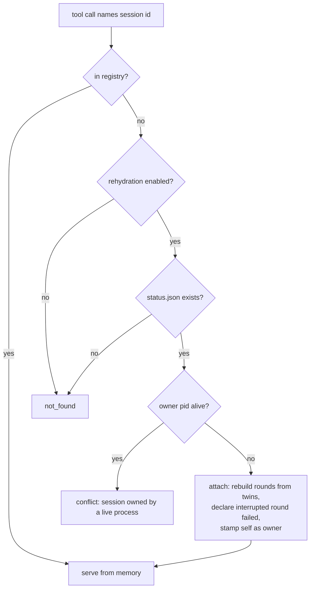

# Session Rehydration

The broker's session registry is the one load-bearing structure in mercurius that lives only in memory. Everything else the loop produces is already a file — snapshots, prompts, config captures, round logs, notes, the status snapshot — but the map that binds a session id to its rounds, refs, and decisions dies with the serving process. When that process dies between tool calls, the tools begin answering `not_found` for sessions whose full record sits intact on disk. This spec makes the registry recoverable from that record — and, in the same stroke, decides who is allowed to recover it.

Nothing here is implemented. Today the registry is in-memory only, and a fresh process serves an empty map.

## The incident that forced it

Born 2026-08-18 from the scry per-check-history-detail-view arc: four sessions in a row lost mid-arc under the pi harness. The `pi-mcp-adapter` shuts down a stdio MCP server after ten minutes without a tool call and respawns it lazily on the next one. In a review arc, the one stretch that reliably exceeds ten minutes of mercurius silence is the human triage between `collect_round` and `record_round_notes` — one finding per turn, by design — so the kill landed in the same seam every time, deterministically. Everything through `collect_round` rode one process; the notes call met a fresh one with an empty map.

The adapter-side correction (`idleTimeout: 0` on the server entry) is applied where we control it. But the premise is now on the record: a stdio server's lifetime is whatever the harness adapter gives it. Mercurius must stop depending on a lifetime it does not control.

## The gap in the durable record

The practice's posture is that files are the truth, and mercurius almost honors it already. Per session, `status.json` carries the skeleton — state, timestamps, round list, has-notes flags — atomically rewritten on every mutation. Per round, the directory carries the snapshots, `_prompt.md`, `_config.yaml`, `_round.md`, and `_notes.md`. Two things are missing, and they are different in kind:

- **Machine-readability.** The raw reviewer output and the recorded decisions exist on disk only inside human markdown. `_round.md` embeds the reviewer's json in a fenced block; `_notes.md` renders decisions as prose bullets. A rebuild that parses those back turns documents written for people into serialization formats wearing prose.
- **Ownership.** Nothing on disk says which process is serving a session. That absence is harmless while the registry is memory-only — a second process simply cannot see the sessions — but it becomes load-bearing the moment a fresh process can attach to what an old one left behind.

## The shape: lazy, on-miss

Rehydration triggers at exactly one point: a registry miss. When `b.session(id)` fails, the broker looks for `<log_destination>/<id>/status.json` — the session id is the directory name, so this is a direct path probe, not a scan — and rebuilds the session from the durable record if the probe succeeds and ownership allows. There is no boot-time pass: a lazy miss covers sessions from *any* prior process, not just the last one, and a deployment whose process never dies never executes the path. A miss with no directory behind it is the same cheap `not_found` as today.

## Machine twins, written in the same motion

The rebuild never parses markdown. Instead, the moments that today write the human record also write a machine twin beside it:

- **`_review.json`** — written once, at round success, in the same motion as `_round.md`. Carries the raw reviewer output, the usage notes, and the artifact manifest. Immutable, like the round log it shadows. The refs a round accepts for decisions are not stored separately: they recompute from the raw output through the same schema parse that produced them live, so there is one source.
- **`_notes.json`** — written by `record_round_notes` in the same motion as `_notes.md`, and rewritten when notes are re-recorded, exactly as the markdown is. Carries commentary and the decisions array, which the close-time synopsis needs.

The `_` prefix is already reserved for broker meta files — artifact names cannot begin with it — so the twins cannot collide with snapshots. `status.json` gains exactly one field, the owner pid, and otherwise stays the lean monitor snapshot that `status-json-error-bloat.md` argues it must remain; round payloads belong in per-round files, not in a document rewritten on every mutation.

Sessions created before the twins exist are not rehydratable. The refusal answers `not_found` — for the caller, the effect is identical to today — with a detail naming the missing twin so the operator knows why. There is no backfill parser; git history and hand recovery cover the rare want, and the coupling cost of parsing `_round.md` would be permanent.

## Ownership: a sentinel, not a lock

A session belongs to one live process. The serving process stamps its pid into `status.json` on every persist — unconditionally, whatever its own rehydration disposition — and rehydration reads that stamp at the one destructive moment in the design:

- **Owner alive** → refuse with `conflict`: the session is being served; use the harness that holds it.
- **Owner dead** → take over: rebuild the session, stamp self as owner, and declare any round still recorded as `running` failed — its goroutine died with its process — removing the half-written round directory per the existing atomic-discard convention for failed rounds.

This is deliberately not a lock file. Locks under a process that dies without warning need a lifecycle: staleness heuristics, heartbeats, repair paths — and a broker whose premise is "the harness kills us whenever it likes" would live in the stale-lock case permanently. The sentinel asks liveness directly, exactly once, exactly where the answer changes what happens, and death releases ownership by itself. The residual is pid reuse: a recycled pid can read as a false "alive," which fails in the conservative direction — a refusal the operator retries — and is documented rather than engineered away.

The two-harness pattern stays legitimate and untouched. Two processes on one project today hold disjoint session sets, and that remains the normal case; rehydration crosses a harness line only when the previous owner is dead.

## The per-harness disposition: `--no-rehydration`

A command-line flag on the server, not a `mercurius.yaml` setting. The launch line in each harness's MCP config is the per-harness surface — `--verbose` already lives there for the same reason — and rehydration disposition is genuinely per-harness: the same project can hand takeover rights to the harness that needs them and confine another to sessions it opened itself. `mercurius.yaml` is project posture and cannot express that split.

Disabled means today's behavior, exactly: a registry miss returns `not_found`, no disk probe, no attach, no takeover. The owner stamp is still written — other processes judging ownership need the truth regardless of this one's disposition. Default is on; the flag is the opt-out.

## Closed sessions rehydrate too

A closed session's record is complete on disk, and the mutating tools already refuse the closed state, so rehydrating one is read-only in effect. `session_status` keeps answering across respawns, and `close_session`'s `_synopsis.md` — today the one output genuinely lost to a restart, since it renders from in-memory state — becomes reachable after any respawn: the synopsis rebuilds from the twins.

## What this does not fix

A round killed mid-flight is not recoverable by anything written here. The reviewer subprocess is a child of the server; when the harness kills the server during a running round, the reviewer dies with it, and no disk record resurrects a half-run subprocess. That hazard is real — `start_review_round` returns immediately, so a running round holds no in-flight request to keep an idle-timeout adapter at bay — and its fix is harness-side process lifetime, already applied for pi. Rehydration's contribution is honest failure: the takeover declares the orphaned round failed instead of leaving `status.json` frozen at `running` forever.

Rehydration is also not history. It persists operational state so a session survives its process, one session at a time, on demand. The broker's deliberate refusal to keep a queryable corpus of past sessions (`fidelity-gate.md` leans on this) is unchanged.

## Scenarios

**The arc, replayed.** The adapter kills mercurius during triage. `record_round_notes` arrives on a fresh process, misses the registry, probes the session directory, finds the owner pid dead, attaches, validates the decision refs against the raw output recomputed from `_review.json`, and writes the notes. `close_session` then renders a full synopsis. The operator never learns the process died.

**The live owner.** pi's mercurius is mid-round on a session. From another harness, an agent calls `session_status` on that same id. Its process misses, probes, finds the owner alive, and answers `conflict: session is owned by a live process`. The round directory is never touched. (Cross-harness peeking at a live session already has a home: the CLI monitor reads `status.json` directly.)

**The crash takeover.** mercurius dies mid-round — crash, kill, adapter shutdown. The next tool call on that session, from whichever process gets it, finds the owner dead, attaches, marks the interrupted round failed with a clear error, discards its half-written directory, and the agent starts the next round in the same session.

**The confined harness.** A harness launched with `--no-rehydration` calls a tool with a session id its process didn't create. `not_found`, exactly as today — it serves only its own sessions, while still stamping ownership on those.

## Seam census

- **Ownership device** — *call:* pid sentinel in `status.json`, not a lock file. *Why:* locks need lifecycle and staleness repair under a process that dies without warning; the sentinel asks liveness directly at the single destructive moment and releases on death. *Revisit:* if pid-reuse false-alives are ever observed in practice, add process-start-time disambiguation.
- **Disposition surface** — *call:* CLI flag only; no yaml setting. *Why:* per-harness dispositions live on the launch line (`--verbose` precedent); yaml is project posture and cannot split harnesses. *Revisit:* a demonstrated want for a project-wide default.
- **Machine/human record** — *call:* separate machine twins written in the same motion as the human documents; markdown is never parsed back. *Why:* a parser over `_round.md` makes prose a wire format and couples the human document to it permanently. *Revisit:* none foreseen.
- **Read-only pass-through** — *call:* defer; every tool resolves rehydrate-or-refuse uniformly, with no disk-serving read path for live-owned sessions. *Why:* two resolution tiers for one tool surface is machinery without a demonstrated want; the CLI monitor already covers cross-harness observation. *Revisit:* a recurring real need to query a live-owned session over MCP.
- **Error by tier** — *call:* `conflict` for a live-owner refusal; `not_found` with an explanatory detail for a non-rehydratable directory; `internal_error` for a corrupt `status.json`. *Why:* the caller's recovery differs per case — use the other harness; treat the session as gone; look at the disk. *Revisit:* none foreseen.

## Deferred (and why)

- **Mid-round survival or resume.** The reviewer child dies with the server; the fix is harness-side lifetime, already applied where we control it. Rehydration only makes the death honest.
- **Backfill for pre-twin sessions.** A `_round.md` parser would exist solely to serve sessions predating the feature, at a permanent coupling cost. Refuse with a clear message instead.
- **Heartbeats, leases, lock lifecycles.** The defensive spiral the sentinel exists to avoid. The one question that matters — is the owner alive — is answerable directly.
- **Pid start-time disambiguation.** Reuse false-alives fail conservative; engineer for them only on evidence.
- **Project-wide yaml toggle.** The per-harness flag is the actual driver; a project default has no demonstrated want.
- **Live multi-attach.** Two live processes deliberately serving one session is refused by design, not supported. No real workflow demands it.
- **Queryable session history.** Out of scope and out of posture; rehydration is operational survival, not a corpus.

## Related

- `status-json-error-bloat.md` — `status.json`'s lean identity, which pushes round payloads into per-round twins rather than the snapshot.
- `web-monitor-and-trajectory.md` — reads `status.json` as its substrate; gains visibility of the owner field, otherwise untouched.
- `fidelity-gate.md` — the no-corpus posture this spec deliberately leaves intact.
- `docs/current/` (architecture, operations, mcp-tools) — the surfaces this re-synthesizes into when built.
